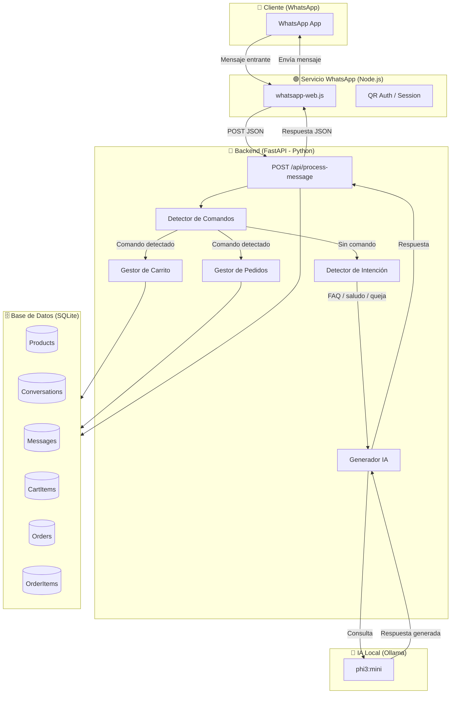
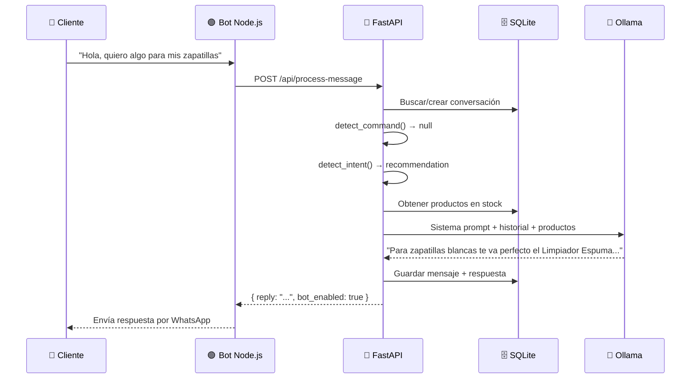
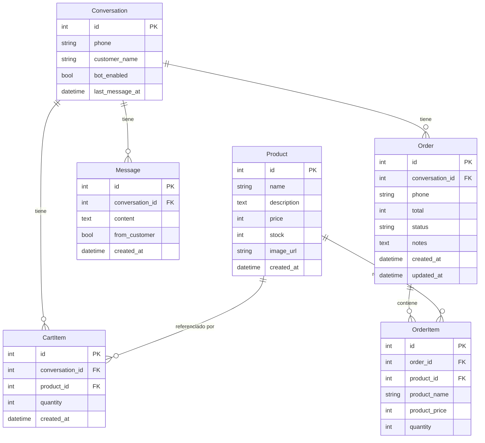

# 🛍️ InstantVende MVP

**Bot de ventas para WhatsApp con IA local (Ollama) — para pequeños negocios**

InstantVende permite a tiendas pequeñas tener un **vendedor automático en WhatsApp** que atiende clientes 24/7, maneja catálogo de productos, carritos de compra y pedidos — todo sin necesidad de servicios cloud de IA.

---

## 🚀 Inicio Rápido — Arrancar todo el sistema

> **Primera vez?** Completa primero la sección [Configuración inicial](#-configuración-inicial) más abajo.

### Windows

```bat
start.bat
```

### Linux / Mac

```bash
chmod +x start.sh
./start.sh
```

Ambos scripts hacen automáticamente:
1. Instalan dependencias de WhatsApp (`npm install`)
2. Instalan y compilan el panel de administración (`npm install && npm run build`)
3. Inician los 3 servicios con PM2 (con auto-restart)

Cuando terminen verás:

```
Backend API:   http://localhost:8000
Docs API:      http://localhost:8000/docs
Panel Admin:   http://localhost:3000
```

> **⚠️ Primera conexión WhatsApp:** Ejecuta `pm2 logs instantvende-wa` para ver el código QR y escanearlo con tu teléfono.

---

## ✨ Funcionalidades

| Módulo | Descripción |
|--------|-------------|
| 🤖 **Bot IA (Favio)** | Vendedor carismático con personalidad definida — responde naturalmente en español |
| 📋 **Catálogo interactivo** | Clientes escriben `#catalogo` y ven todos los productos formateados |
| 🛒 **Carrito de compras** | Agregan productos con `agregar [número]`, ven su carrito con `#carrito` |
| 📦 **Pedidos** | Confirmación con `#pedido`, tracking de estado (pendiente → enviado → entregado) |
| ✅ **Validación de stock** | Avisos automáticos si un producto está agotado |
| 💬 **FAQ automático** | Respuestas instantáneas a horarios, envíos, pagos, garantía, devoluciones |
| 🧠 **Detección de intención** | Clasifica mensajes: compra, recomendación, queja, objeción de precio, saludo |
| 📊 **Analytics** | Dashboard con ventas, pedidos por estado, productos top y revenue |
| 👨‍💼 **Control humano** | Activar/desactivar el bot por conversación para intervención manual |

---

## 🏗️ Arquitectura



---

## 🔗 Flujo de un mensaje



---

## 🗄️ Modelo de datos



---

## 📁 Estructura del proyecto

```
instantvende/
├── backend/                    # API FastAPI (Python)
│   ├── main.py                 # Endpoints, lógica de bot, IA
│   ├── database.py             # Modelos SQLAlchemy (SQLite)
│   ├── config.py               # Variables de configuración
│   ├── bot_profile.json        # Perfil editable del bot
│   └── requirements.txt        # Dependencias Python
│
├── whatsapp/                   # Cliente WhatsApp (Node.js)
│   ├── whatsapp_client.js      # Conexión WhatsApp Web + envío de mensajes
│   └── package.json            # Dependencias Node.js
│
├── frontend/                   # Panel de administración (React + Vite)
│   ├── src/                    # Componentes React
│   ├── vite.config.js          # Config Vite (puerto 3000, proxy a :8000)
│   └── package.json            # Dependencias Node.js
│
├── ecosystem.config.js         # Config PM2 — gestiona los 3 servicios
├── start.bat                   # Script de inicio para Windows
├── start.sh                    # Script de inicio para Linux / Mac
└── README.md
```

---

## 🔒 Configuración inicial

> Completa estos pasos **una sola vez** antes de ejecutar `start.bat` / `start.sh`.

### Prerequisitos

- Python 3.10+ (con `pip`)
- Node.js 18+ (con `npm`)
- [Ollama](https://ollama.com) instalado y corriendo

### 1. Instalar Ollama y el modelo de IA

```bash
# Instalar Ollama (Mac/Linux)
curl -fsSL https://ollama.com/install.sh | sh

# Windows: descarga el instalador desde https://ollama.com

# Descargar el modelo (≈2GB)
ollama pull phi3:mini
```

### 2. Crear los archivos `.env`

```bash
# Backend
cp backend/.env.example backend/.env

# Cliente WhatsApp
cp whatsapp/.env.example whatsapp/.env

# Panel de administración
cp frontend/.env.example frontend/.env
```

### 3. Generar la API Key (seguridad)

```bash
python -c "import secrets; print(secrets.token_hex(32))"
```

Copia el valor generado en **ambos archivos**:
- `backend/.env` → `API_SECRET_KEY=<valor>`
- `whatsapp/.env` → `BACKEND_API_KEY=<valor>` ← debe ser **el mismo** valor

### 4. Instalar dependencias Python del backend

```bash
cd backend

# Crear entorno virtual (recomendado)
python -m venv venv

# Activar (Windows)
venv\Scripts\activate
# Activar (Mac/Linux)
source venv/bin/activate

# Instalar dependencias
pip install -r requirements.txt
```

> **Nota:** El script `start.sh` (Linux/Mac) hace este paso automáticamente.  
> En Windows, hazlo manualmente antes de ejecutar `start.bat`.

---

## 🔒 Configuración de Seguridad

### Variables de entorno

| Característica | Descripción |
|----------------|-------------|
| 🔑 **API Keys** | Todos los endpoints críticos requieren `X-API-Key` en el header |
| 📋 **Logging JSON** | Logs estructurados en `logs/app.log` y `logs/errors.log` con rotación automática |
| 💾 **Backups automáticos** | La BD se respalda cada 6 horas en `backups/` (configurable) |
| ⚙️ **Config centralizada** | Todas las variables en `.env` — nunca hardcodeadas en el código |
| 🛡️ **Validaciones** | Stock y precio validados en BD + Pydantic en endpoints |
| 🚨 **Manejo de errores** | Excepciones personalizadas con respuestas HTTP claras |

---

## 🤖 Comandos del bot

Los clientes pueden escribir estos comandos en el chat:

| Comando | Acción |
|---------|--------|
| `#catalogo` | Ver todos los productos disponibles |
| `agregar [N]` | Agregar el producto N al carrito |
| `#carrito` | Ver productos en el carrito |
| `#pedido` | Confirmar y crear el pedido |
| `#limpiar` | Vaciar el carrito |
| `#estado` | Ver estado del último pedido |
| `#ayuda` | Ver lista de comandos |

---

## 📡 API Endpoints

### Productos
| Método | Ruta | Descripción |
|--------|------|-------------|
| `GET` | `/api/products` | Listar productos |
| `POST` | `/api/products` | Crear producto |

### Mensajes y Conversaciones
| Método | Ruta | Descripción |
|--------|------|-------------|
| `POST` | `/api/process-message` | Procesar mensaje entrante de WhatsApp |
| `GET` | `/api/conversations` | Listar todas las conversaciones |
| `GET` | `/api/conversations/{id}/messages` | Mensajes de una conversación |
| `PATCH` | `/api/conversations/{id}/toggle-bot` | Activar/desactivar bot |

### Carrito
| Método | Ruta | Descripción |
|--------|------|-------------|
| `POST` | `/api/cart/{phone}/add` | Agregar item al carrito |
| `GET` | `/api/cart/{phone}` | Ver carrito de un cliente |
| `DELETE` | `/api/cart/{phone}` | Vaciar carrito |

### Pedidos
| Método | Ruta | Descripción |
|--------|------|-------------|
| `GET` | `/api/orders` | Listar pedidos (filtrar por `?status=`) |
| `GET` | `/api/orders/{id}` | Detalle de un pedido |
| `PATCH` | `/api/orders/{id}/status` | Actualizar estado del pedido |

### Analytics y Sistema
| Método | Ruta | Descripción |
|--------|------|-------------|
| `GET` | `/api/analytics` | Dashboard de métricas |
| `GET` | `/api/health/ollama` | Estado del modelo IA |
| `GET` | `/` | Health check general |

---

## 🧠 Stack tecnológico

| Tecnología | Uso | Versión |
|------------|-----|---------|
| **FastAPI** | Framework API REST | 0.135.2 |
| **SQLAlchemy** | ORM base de datos | 2.0.48 |
| **SQLite** | Base de datos local | Built-in |
| **Pydantic** | Validación de datos | 2.12.5 |
| **Ollama** | Cliente IA local | 0.6.1 |
| **phi3:mini** | Modelo de lenguaje | Microsoft |
| **whatsapp-web.js** | Interfaz WhatsApp | 1.34.6 |
| **Node.js** | Runtime WhatsApp | 18+ |
| **Uvicorn** | Servidor ASGI | 0.42.0 |

---

## 🔧 Configuración

Las constantes del bot se configuran directamente en los archivos:

**`whatsapp/whatsapp_client.js`**
```javascript
const BACKEND_URL = 'http://localhost:8000';  // URL del backend
const BUSINESS_NAME = 'InstantVende';
```

**`backend/main.py`**
```python
# FAQ_RESPONSES → textos de respuestas automáticas
# BOT_COMMANDS  → comandos del bot y sus triggers
# modelo Ollama: 'phi3:mini' (cambiar para usar otro modelo)
```

---

## 📊 Estados de Pedido

```
pending → confirmed → shipped → delivered
                              ↘
                           cancelled (restaura stock automáticamente)
```

---

## 🖥️ Producción con PM2 (auto-restart)

PM2 mantiene los 3 servicios corriendo 24/7 y los reinicia automáticamente si se caen.

### Servicios gestionados

| Servicio | Nombre PM2 | URL |
|----------|-----------|-----|
| Backend FastAPI | `instantvende-api` | http://localhost:8000 |
| Bot WhatsApp | `instantvende-wa` | — |
| Panel Admin | `instantvende-admin` | http://localhost:3000 |

### Iniciar todo con un comando

```bash
# Windows — instala deps, compila frontend e inicia PM2
start.bat

# Mac / Linux — instala deps, compila frontend e inicia PM2
chmod +x start.sh && ./start.sh
```

> **Nota:** El panel de administración necesita compilarse (`npm run build`) antes de iniciarse con PM2. Los scripts `start.bat` y `start.sh` lo hacen automáticamente.

### Comandos útiles

```bash
pm2 status                       # Estado de los 3 servicios
pm2 logs                         # Logs en tiempo real (todos)
pm2 logs instantvende-api        # Solo logs del backend
pm2 logs instantvende-wa         # Solo logs de WhatsApp (ver QR aquí)
pm2 logs instantvende-admin      # Solo logs del panel
pm2 restart instantvende-api     # Reiniciar backend
pm2 restart instantvende-wa      # Reiniciar WhatsApp
pm2 restart instantvende-admin   # Reiniciar panel
pm2 stop all                     # Detener todo
pm2 delete all                   # Quitar de PM2
```

### Auto-arranque al reiniciar el servidor

```bash
pm2 startup       # Genera el comando según tu OS (ejecutar el comando que muestra)
pm2 save          # Guarda el estado actual para que arranque automático
```

### Comportamiento ante fallos

| Evento | Respuesta |
|--------|-----------|
| Backend cuelgue/crash | PM2 reinicia el proceso automáticamente |
| WhatsApp client cae | PM2 reinicia (espera 5s para evitar loop) |
| Panel admin cae | PM2 reinicia automáticamente |
| Timeout de Ollama | El bot responde con mensaje de fallback, sin reinicio |
| Backend no responde (ECONNREFUSED) | WhatsApp client envía mensaje de error al cliente |
| Backend usa >500MB RAM | PM2 reinicia el proceso para liberar memoria |

Los logs se guardan en `./logs/` con timestamp.

---

## �📝 Licencia

MIT — Libre para uso personal y comercial.

---

## 🖥️ Panel de Administración Web

El panel de administración es una aplicación React moderna con diseño "Dark Glass Morphism" que permite gestionar todos los aspectos de InstantVende desde el navegador.

### Características

| Módulo | Descripción |
|--------|-------------|
| 📊 **Dashboard** | KPIs, gráficas de pedidos por estado y top productos |
| 💬 **Conversaciones** | Lista de chats con toggle de bot inline y búsqueda |
| 💬 **Chat detalle** | Historial de mensajes estilo WhatsApp con burbujas |
| 📦 **Productos** | CRUD completo con imágenes, precios y stock |
| 🛒 **Pedidos** | Gestión de estados, detalle de pedidos y filtros |
| 🤖 **Perfil del Bot** | Editor completo de identidad, horarios, envíos y IA |

### Modo desarrollo (hot-reload)

```bash
cd frontend
npm install
npm run dev
# → http://localhost:3000  (con proxy a backend en :8000)
```

### Modo producción con PM2

Los scripts `start.bat` / `start.sh` hacen esto automáticamente. Para hacerlo a mano:

```bash
cd frontend
npm install
npm run build          # Genera dist/
cd ..
pm2 start ecosystem.config.js --only instantvende-admin
# → http://localhost:3000
```

### Configuración

Copia `.env.example` a `.env` en el directorio `frontend/`:

```bash
cp frontend/.env.example frontend/.env
```

Variables disponibles:

| Variable | Default | Descripción |
|----------|---------|-------------|
| `VITE_API_URL` | `http://localhost:8000` | URL del backend FastAPI |

### Autenticación

El panel usa la misma `API_SECRET_KEY` configurada en el backend. Al abrir el panel por primera vez, se pedirá la clave que se guarda en `localStorage`.
